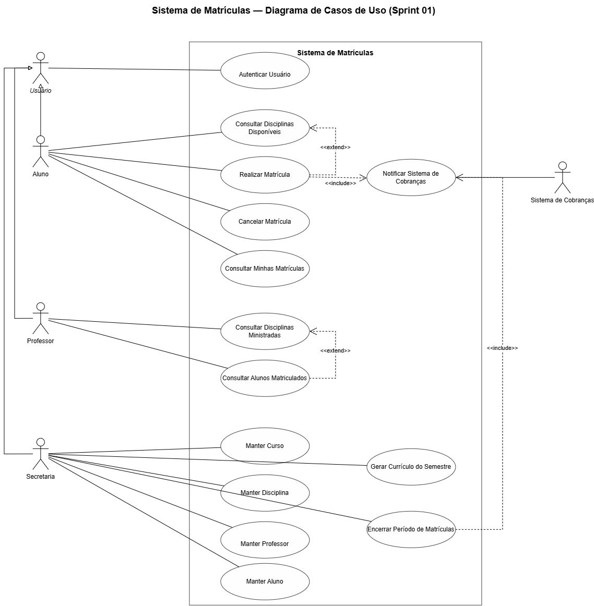
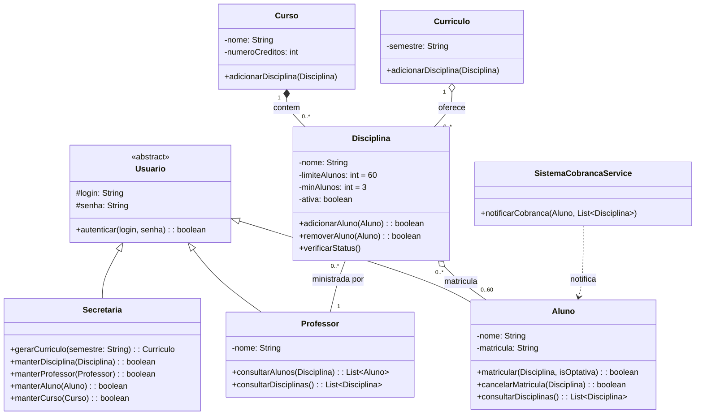

# Sistema de Matrículas

Sistema de Matrículas desenvolvido para a disciplina **Projeto de Software** do curso de **Engenharia de Software** da Pontifícia Universidade Católica de Minas Gerais (PUC Minas).

O projeto tem como objetivo aplicar, de forma prática, conceitos de **engenharia de software, análise de requisitos, modelagem UML, arquitetura de software e desenvolvimento orientado a objetos**, seguindo o processo de desenvolvimento proposto pela disciplina.

---

## 📚 Contexto

Uma universidade deseja informatizar seu processo de matrículas.

A secretaria da universidade é responsável por gerar o currículo de cada semestre e manter as informações referentes a **cursos, disciplinas, professores e alunos**.

Durante um período determinado, os alunos podem acessar o sistema para realizar suas matrículas e cancelar matrículas realizadas anteriormente.

O sistema deve controlar a quantidade de alunos inscritos em cada disciplina. Uma disciplina somente será realizada no semestre seguinte caso possua **pelo menos 3 alunos matriculados** ao final do período de matrículas.

Cada disciplina possui um limite máximo de **60 alunos**. Ao atingir esse limite, novas matrículas para a disciplina são encerradas.

Após a matrícula de um aluno, o sistema de matrículas deve notificar o **sistema de cobranças**, permitindo que o aluno seja cobrado pelas disciplinas nas quais está matriculado.

Os professores também possuem acesso ao sistema para consultar os alunos matriculados em suas respectivas disciplinas.

Todos os usuários do sistema possuem credenciais utilizadas para autenticação.

---

## 🎯 Objetivo

Desenvolver um protótipo funcional de um **Sistema de Matrículas Universitário**, contemplando as principais funcionalidades descritas pelo Product Owner.

O desenvolvimento será realizado de forma incremental ao longo das sprints, utilizando **Java** e os modelos UML produzidos durante o projeto.

---

## 👥 Usuários do sistema

O sistema possui diferentes tipos de usuários, cada um com responsabilidades específicas:

* **Aluno**

  * Consultar disciplinas disponíveis.
  * Realizar matrículas.
  * Cancelar matrículas.
  * Consultar suas matrículas.

* **Professor**

  * Consultar as disciplinas que ministra.
  * Consultar os alunos matriculados em suas disciplinas.

* **Secretaria**

  * Gerenciar informações acadêmicas.
  * Gerar e manter o currículo de cada semestre.
  * Gerenciar cursos e disciplinas.
  * Manter informações de alunos e professores.

* **Sistema de Cobranças**

  * Receber notificações referentes às matrículas realizadas para um determinado semestre.

---

## 📋 Regras de negócio

O sistema deve respeitar as seguintes regras:

1. Um aluno pode se matricular em até **4 disciplinas como primeira opção (obrigatórias)**.

2. Um aluno pode se matricular em até **2 disciplinas alternativas (optativas)**.

3. As matrículas somente podem ser realizadas durante o **período de matrículas**.

4. Durante o período de matrículas, o aluno pode cancelar matrículas realizadas anteriormente.

5. Uma disciplina pode possuir no máximo **60 alunos matriculados**.

6. Ao atingir 60 alunos matriculados, novas matrículas para a disciplina devem ser encerradas.

7. Uma disciplina somente será realizada no semestre seguinte caso possua pelo menos **3 alunos matriculados** ao final do período de matrículas.

8. Caso uma disciplina possua menos de 3 alunos matriculados ao final do período, ela será **cancelada**.

9. Após a matrícula de um aluno, o sistema de matrículas deve notificar o **sistema de cobranças**.

10. Todos os usuários devem possuir **login e senha** para acesso ao sistema.

---

## 📝 Histórias de Usuário

### Aluno

* [x] Como aluno, quero realizar login no sistema para acessar minhas funcionalidades.
* [x] Como aluno, quero consultar as disciplinas disponíveis para o semestre.
* [x] Como aluno, quero me matricular em até 4 disciplinas como primeira opção (obrigatórias).
* [x] Como aluno, quero me matricular em até 2 disciplinas alternativas (optativas).
* [x] Como aluno, quero cancelar uma matrícula realizada anteriormente durante o período de matrículas.
* [x] Como aluno, quero consultar minhas disciplinas matriculadas.

### Professor

* [x] Como professor, quero realizar login no sistema para acessar minhas funcionalidades.
* [x] Como professor, quero consultar as disciplinas que ministro.
* [x] Como professor, quero consultar os alunos matriculados em cada uma das minhas disciplinas.

### Secretaria

* [x] Como secretário, quero realizar login no sistema.
* [x] Como secretário, quero cadastrar e manter informações sobre cursos (nome, créditos).
* [x] Como secretário, quero cadastrar e manter informações sobre disciplinas.
* [x] Como secretário, quero cadastrar e manter informações sobre professores.
* [x] Como secretário, quero cadastrar e manter informações sobre alunos.
* [x] Como secretário, quero gerar o currículo de um semestre contendo as disciplinas.

### Sistema (Regras Automáticas)

* [x] Como sistema, quero cancelar automaticamente as disciplinas que tiverem menos de 3 alunos inscritos ao final do período de matrículas.
* [x] Como sistema, quero encerrar novas matrículas para uma disciplina assim que ela atingir 60 alunos.

### Sistema de Cobranças

* [x] Como sistema de cobranças, quero ser notificado após um aluno se matricular em um semestre para que as disciplinas possam ser cobradas do aluno.

---

## 📐 Modelagem

A modelagem do sistema será desenvolvida e atualizada ao longo das sprints.

### Diagrama de Caso de Uso



### Diagrama de Classes



### Arquitetura do Sistema

> Será definida e documentada durante o desenvolvimento do projeto.

---

## 🏃 Sprints

O projeto será desenvolvido em três sprints principais.

### Sprint 01 — Análise

**Entregas:**

* Diagrama de Caso de Uso;
* Histórias de Usuário;
* Documentação inicial dos requisitos;
* Correções e evolução dos modelos conforme feedback.

**Status:** ✅ Concluído

---

### Sprint 02 — Projeto Estrutural

**Entregas:**

* Correção do Diagrama de Caso de Uso;
* Diagrama de Classes;
* Criação do projeto Java;
* Classes e atributos;
* Stubs dos métodos modelados.

**Status:** ✅ Concluído

---

### Sprint 03 — Implementação

**Entregas:**

* Correção dos diagramas;
* Implementação das principais funcionalidades;
* Interface do sistema;
* Persistência dos dados;
* Protótipo funcional;
* Alinhamento entre os modelos UML e o código.

**Status:** ⏳ A iniciar

---

## 🛠️ Tecnologias

As tecnologias utilizadas no projeto serão definidas conforme a evolução do desenvolvimento.

Inicialmente:

* **Java**
* **Git**
* **GitHub**

A interface poderá ser implementada em **linha de comando**, conforme permitido pela especificação da disciplina, e a persistência poderá ser realizada utilizando **arquivos**.

---

## 📁 Estrutura do projeto

A estrutura do projeto será definida durante as sprints e atualizada conforme sua implementação.

```text
sistema-matriculas/
├── README.md
├── caso-de-uso.drawio.png
└── src/
    └── main/
        └── java/
            └── br/
                └── pucminas/
                    └── matricula/
                        ├── models/
                        │   ├── Aluno.java
                        │   ├── Curriculo.java
                        │   ├── Curso.java
                        │   ├── Disciplina.java
                        │   ├── Professor.java
                        │   ├── Secretaria.java
                        │   └── Usuario.java
                        └── services/
                            └── SistemaCobrancaService.java
```

---

## 📊 Processo de Desenvolvimento

O projeto seguirá o processo definido na disciplina **Projeto de Software**, evoluindo progressivamente dos requisitos e modelos de análise para o projeto estrutural e, posteriormente, para a implementação.

As versões dos modelos UML deverão ser mantidas no repositório para permitir o acompanhamento da evolução do projeto.

---

## 👨‍💻 Equipe

| Nome      |
| --------- |
| Lucas Tameirão |
| Bernardo Avendanho |

---

## 📄 Disciplina

**Projeto de Software**
Curso de Engenharia de Software
Pontifícia Universidade Católica de Minas Gerais — PUC Minas
**2º semestre de 2026**

**Professora:** Milena Menezes Adão
