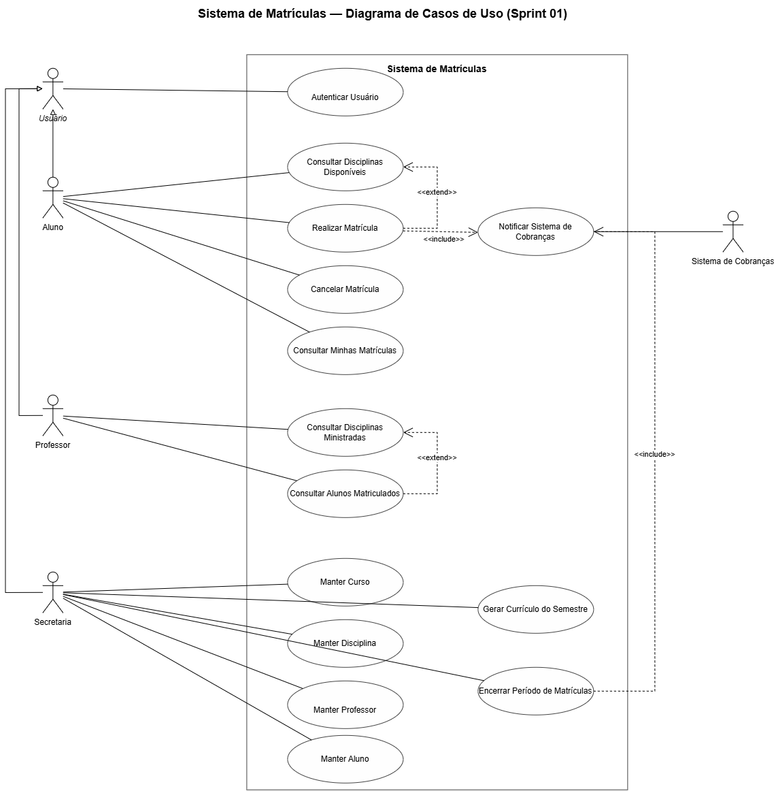
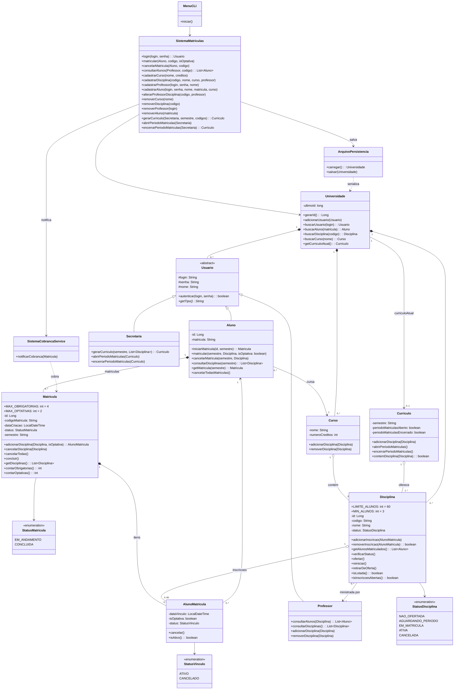
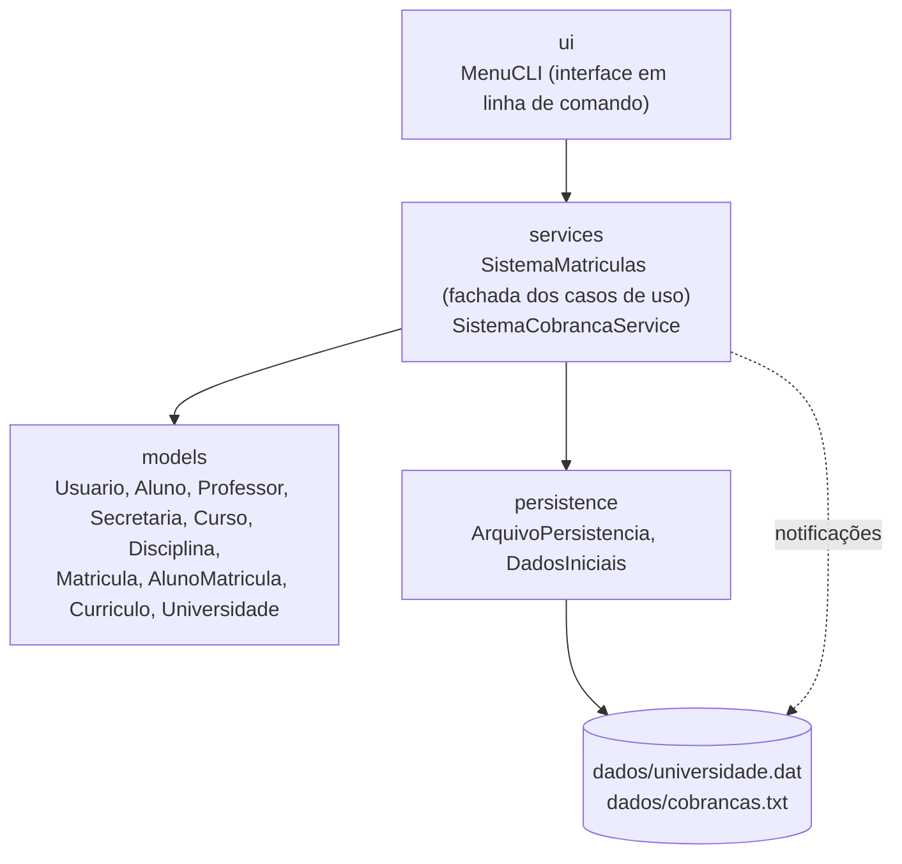

# Sistema de Matrículas

Sistema de Matrículas desenvolvido para a disciplina **Projeto de Software** do curso de **Engenharia de Software** da Pontifícia Universidade Católica de Minas Gerais (PUC Minas).

O projeto tem como objetivo aplicar, de forma prática, conceitos de **engenharia de software, análise de requisitos, modelagem UML, arquitetura de software e desenvolvimento orientado a objetos**, seguindo o processo de desenvolvimento proposto pela disciplina.

---

## 📚 Contexto

Uma universidade deseja informatizar seu processo de matrículas.

A secretaria da universidade é responsável por gerar o currículo de cada semestre e manter as informações referentes a **cursos, disciplinas, professores e alunos**.

Durante um período determinado, os alunos podem acessar o sistema para realizar suas matrículas e cancelar matrículas realizadas anteriormente.

O sistema deve controlar a quantidade de alunos inscritos em cada disciplina. Uma disciplina somente será realizada no semestre seguinte caso possua **pelo menos 3 alunos matriculados** ao final do período de matrículas.

Cada disciplina possui um limite máximo de **60 alunos**. Ao atingir esse limite, novas matrículas para a disciplina são encerradas.

Após a matrícula de um aluno, o sistema de matrículas deve notificar o **sistema de cobranças**, permitindo que o aluno seja cobrado pelas disciplinas nas quais está matriculado.

Os professores também possuem acesso ao sistema para consultar os alunos matriculados em suas respectivas disciplinas.

Todos os usuários do sistema possuem credenciais utilizadas para autenticação.

---

## 🎯 Objetivo

Desenvolver um protótipo funcional de um **Sistema de Matrículas Universitário**, contemplando as principais funcionalidades descritas pelo Product Owner.

O desenvolvimento será realizado de forma incremental ao longo das sprints, utilizando **Java** e os modelos UML produzidos durante o projeto.

---

## 👥 Usuários do sistema

O sistema possui diferentes tipos de usuários, cada um com responsabilidades específicas:

* **Aluno**

  * Consultar disciplinas disponíveis.
  * Realizar matrículas.
  * Cancelar matrículas.
  * Consultar suas matrículas.

* **Professor**

  * Consultar as disciplinas que ministra.
  * Consultar os alunos matriculados em suas disciplinas.

* **Secretaria**

  * Gerenciar informações acadêmicas.
  * Gerar e manter o currículo de cada semestre.
  * Gerenciar cursos e disciplinas.
  * Manter informações de alunos e professores.

* **Sistema de Cobranças**

  * Receber notificações referentes às matrículas realizadas para um determinado semestre.

---

## 📋 Regras de negócio

O sistema deve respeitar as seguintes regras:

1. Um aluno pode se matricular em até **4 disciplinas como primeira opção (obrigatórias)**.

2. Um aluno pode se matricular em até **2 disciplinas alternativas (optativas)**.

3. As matrículas somente podem ser realizadas durante o **período de matrículas**.

4. Durante o período de matrículas, o aluno pode cancelar matrículas realizadas anteriormente.

5. Uma disciplina pode possuir no máximo **60 alunos matriculados**.

6. Ao atingir 60 alunos matriculados, novas matrículas para a disciplina devem ser encerradas.

7. Uma disciplina somente será realizada no semestre seguinte caso possua pelo menos **3 alunos matriculados** ao final do período de matrículas.

8. Caso uma disciplina possua menos de 3 alunos matriculados ao final do período, ela será **cancelada**.

9. Após a matrícula de um aluno, o sistema de matrículas deve notificar o **sistema de cobranças**.

10. Todos os usuários devem possuir **login e senha** para acesso ao sistema.

---

## 📝 Histórias de Usuário

### Aluno

* [x] Como aluno, quero realizar login no sistema para acessar minhas funcionalidades.
* [x] Como aluno, quero consultar as disciplinas disponíveis para o semestre.
* [x] Como aluno, quero me matricular em até 4 disciplinas como primeira opção (obrigatórias).
* [x] Como aluno, quero me matricular em até 2 disciplinas alternativas (optativas).
* [x] Como aluno, quero cancelar uma matrícula realizada anteriormente durante o período de matrículas.
* [x] Como aluno, quero consultar minhas disciplinas matriculadas.

### Professor

* [x] Como professor, quero realizar login no sistema para acessar minhas funcionalidades.
* [x] Como professor, quero consultar as disciplinas que ministro.
* [x] Como professor, quero consultar os alunos matriculados em cada uma das minhas disciplinas.

### Secretaria

* [x] Como secretário, quero realizar login no sistema.
* [x] Como secretário, quero cadastrar e manter informações sobre cursos (nome, créditos).
* [x] Como secretário, quero cadastrar e manter informações sobre disciplinas.
* [x] Como secretário, quero cadastrar e manter informações sobre professores.
* [x] Como secretário, quero cadastrar e manter informações sobre alunos.
* [x] Como secretário, quero gerar o currículo de um semestre contendo as disciplinas.

### Sistema (Regras Automáticas)

* [x] Como sistema, quero cancelar automaticamente as disciplinas que tiverem menos de 3 alunos inscritos ao final do período de matrículas.
* [x] Como sistema, quero encerrar novas matrículas para uma disciplina assim que ela atingir 60 alunos.

### Sistema de Cobranças

* [x] Como sistema de cobranças, quero ser notificado após um aluno se matricular em um semestre para que as disciplinas possam ser cobradas do aluno.

---

## 📐 Modelagem

A modelagem do sistema será desenvolvida e atualizada ao longo das sprints.

### Diagrama de Caso de Uso



### Diagrama de Classes (v2 — Lab01S03)

Versão atualizada na Sprint 03 para refletir a implementação. As versões anteriores estão em [docs/diagramas/diagrama-classes-v1.md](docs/diagramas/diagrama-classes-v1.md) (Lab01S02) e [docs/diagramas/diagrama-classes-v1.1.md](docs/diagramas/diagrama-classes-v1.1.md) (correção do Lab01S02).

**Principais mudanças em relação à v1.1:**

* `nome` subiu para `Usuario` (todos os usuários têm nome);
* As classes `Matricula` (matrícula do aluno em um semestre) e `AlunoMatricula` (vínculo da matrícula com cada disciplina, com `isOptativa`, `dataVinculo` e `status`) foram implementadas. No código, os campos `alunoId`/`matriculaId`/`disciplinaId` da v1.1 viraram referências diretas aos objetos, e `status` passou de `String` para os enums `StatusMatricula` e `StatusVinculo`;
* A regra de 4 obrigatórias + 2 optativas fica em `Matricula`. Cancelar uma disciplina não apaga o vínculo: ele fica como `CANCELADO` e aparece no histórico do aluno;
* `Aluno` passou a ter vínculo com `Curso`, e os `id` de `Aluno`, `Disciplina` e `Matricula` são gerados por `Universidade.gerarId()`;
* `Disciplina` ganhou `codigo` e um `StatusDisciplina` (Não ofertada / Aguardando período / Em matrícula / Ativa / Cancelada) no lugar do `boolean ativa`;
* `Curriculo` passou a controlar o **período de matrículas** (abrir/encerrar); ao encerrar, cada disciplina verifica o mínimo de 3 alunos;
* Os métodos `manterX` da `Secretaria` foram substituídos pela fachada `SistemaMatriculas`, que concentra os casos de uso, e pela classe `Universidade`, que agrega os dados persistidos;
* Novas classes: `StatusMatricula`, `StatusVinculo`, `Universidade`, `StatusDisciplina`, `SistemaMatriculas`, `ArquivoPersistencia`, `DadosIniciais`, `MenuCLI` e `RegraNegocioException`;
* Violações de regra de negócio passaram a lançar `RegraNegocioException` com mensagem para o usuário, em vez de retornar `boolean`.


```mermaid
classDiagram
    class Usuario {
        <<abstract>>
        #login: String
        #senha: String
        #nome: String
        +autenticar(login, senha): boolean
        +getTipo() String*
    }

    class Aluno {
        -id: Long
        -matricula: String
        +iniciarMatricula(id, semestre): Matricula
        +matricular(semestre, Disciplina, isOptativa: boolean)
        +cancelarMatricula(semestre, Disciplina)
        +consultarDisciplinas(semestre): List~Disciplina~
        +getMatricula(semestre): Matricula
        +cancelarTodasMatriculas()
    }

    class Matricula {
        +MAX_OBRIGATORIAS: int = 4
        +MAX_OPTATIVAS: int = 2
        -id: Long
        -codigoMatricula: String
        -dataCriacao: LocalDateTime
        -status: StatusMatricula
        -semestre: String
        +adicionarDisciplina(Disciplina, isOptativa): AlunoMatricula
        +cancelarDisciplina(Disciplina)
        +cancelarTodas()
        +concluir()
        +getDisciplinas(): List~Disciplina~
        +contarObrigatorias(): int
        +contarOptativas(): int
    }

    class AlunoMatricula {
        -dataVinculo: LocalDateTime
        -isOptativa: boolean
        -status: StatusVinculo
        +cancelar()
        +isAtivo(): boolean
    }

    class StatusMatricula {
        <<enumeration>>
        EM_ANDAMENTO
        CONCLUIDA
    }

    class StatusVinculo {
        <<enumeration>>
        ATIVO
        CANCELADO
    }

    class Professor {
        +consultarAlunos(Disciplina): List~Aluno~
        +consultarDisciplinas(): List~Disciplina~
        +adicionarDisciplina(Disciplina)
        +removerDisciplina(Disciplina)
    }

    class Secretaria {
        +gerarCurriculo(semestre, List~Disciplina~): Curriculo
        +abrirPeriodoMatriculas(Curriculo)
        +encerrarPeriodoMatriculas(Curriculo)
    }

    Usuario <|-- Aluno
    Usuario <|-- Professor
    Usuario <|-- Secretaria

    class Curso {
        -nome: String
        -numeroCreditos: int
        +adicionarDisciplina(Disciplina)
        +removerDisciplina(Disciplina)
    }

    class Disciplina {
        +LIMITE_ALUNOS: int = 60
        +MIN_ALUNOS: int = 3
        -id: Long
        -codigo: String
        -nome: String
        -status: StatusDisciplina
        +adicionarInscricao(AlunoMatricula)
        +removerInscricao(AlunoMatricula): boolean
        +getAlunosMatriculados(): List~Aluno~
        +verificarStatus()
        +ofertar()
        +reiniciar()
        +retirarDeOferta()
        +isLotada(): boolean
        +isInscricoesAbertas(): boolean
    }

    class StatusDisciplina {
        <<enumeration>>
        NAO_OFERTADA
        AGUARDANDO_PERIODO
        EM_MATRICULA
        ATIVA
        CANCELADA
    }

    class Curriculo {
        -semestre: String
        -periodoMatriculasAberto: boolean
        -periodoMatriculasEncerrado: boolean
        +adicionarDisciplina(Disciplina)
        +abrirPeriodoMatriculas()
        +encerrarPeriodoMatriculas()
        +contemDisciplina(Disciplina): boolean
    }

    class Universidade {
        -ultimoId: long
        +gerarId(): Long
        +adicionarUsuario(Usuario)
        +buscarUsuario(login): Usuario
        +buscarAluno(matricula): Aluno
        +buscarDisciplina(codigo): Disciplina
        +buscarCurso(nome): Curso
        +getCurriculoAtual(): Curriculo
    }

    class SistemaMatriculas {
        +login(login, senha): Usuario
        +matricular(Aluno, codigo, isOptativa)
        +cancelarMatricula(Aluno, codigo)
        +consultarAlunos(Professor, codigo): List~Aluno~
        +cadastrarCurso(nome, creditos)
        +cadastrarDisciplina(codigo, nome, curso, professor)
        +cadastrarProfessor(login, senha, nome)
        +cadastrarAluno(login, senha, nome, matricula, curso)
        +alterarProfessorDisciplina(codigo, professor)
        +removerCurso(nome)
        +removerDisciplina(codigo)
        +removerProfessor(login)
        +removerAluno(matricula)
        +gerarCurriculo(Secretaria, semestre, codigos): Curriculo
        +abrirPeriodoMatriculas(Secretaria)
        +encerrarPeriodoMatriculas(Secretaria): Curriculo
    }

    class SistemaCobrancaService {
        +notificarCobranca(Matricula)
    }

    class ArquivoPersistencia {
        +carregar(): Universidade
        +salvar(Universidade)
    }

    class MenuCLI {
        +iniciar()
    }

    Curso "1" o-- "0..*" Disciplina : contém
    Aluno "0..*" --> "1" Curso : cursa
    Curriculo "1" o-- "1..*" Disciplina : oferece
    Disciplina "0..*" --> "1" Professor : ministrada por
    Aluno "1" *-- "0..*" Matricula : matriculas
    Matricula "1" *-- "0..*" AlunoMatricula : itens
    AlunoMatricula "0..*" --> "1" Aluno
    Disciplina "1" o-- "0..60" AlunoMatricula : inscricoes
    Matricula --> StatusMatricula
    AlunoMatricula --> StatusVinculo
    Disciplina --> StatusDisciplina
    Universidade "1" *-- "0..*" Usuario
    Universidade "1" *-- "0..*" Curso
    Universidade "1" *-- "0..*" Disciplina
    Universidade "1" --> "0..1" Curriculo : curriculoAtual
    SistemaMatriculas --> Universidade
    SistemaMatriculas --> SistemaCobrancaService : notifica
    SistemaCobrancaService ..> Matricula : cobra
    SistemaMatriculas --> ArquivoPersistencia : salva
    MenuCLI --> SistemaMatriculas
    ArquivoPersistencia ..> Universidade : serializa
```

### Arquitetura do Sistema

O sistema segue uma arquitetura em camadas simples:


```mermaid
flowchart TD
    UI["ui<br/>MenuCLI (interface em linha de comando)"]
    SRV["services<br/>SistemaMatriculas (fachada dos casos de uso)<br/>SistemaCobrancaService"]
    MOD["models<br/>Usuario, Aluno, Professor, Secretaria, Curso, Disciplina,<br/>Matricula, AlunoMatricula, Curriculo, Universidade"]
    PER["persistence<br/>ArquivoPersistencia, DadosIniciais"]
    ARQ[("dados/universidade.dat<br/>dados/cobrancas.txt")]

    UI --> SRV
    SRV --> MOD
    SRV --> PER
    PER --> ARQ
    SRV -. notificações .-> ARQ
```

* **ui** — lê a entrada do usuário e exibe os resultados; não contém regras de negócio.
* **services** — `SistemaMatriculas` orquestra os casos de uso (login, matrícula, cadastros, período de matrículas), aplica as regras que dependem de contexto (ex.: só matricular durante o período aberto), notifica o sistema de cobranças e salva os dados após cada alteração.
* **models** — entidades do domínio com as regras de negócio (limite de 4 obrigatórias + 2 optativas na `Matricula`, máximo de 60 alunos e mínimo de 3 alunos na `Disciplina`).
* **persistence** — salva/carrega todos os dados em arquivo via serialização Java e cria dados de exemplo na primeira execução.
* **Sistema de cobranças** — simulado por `SistemaCobrancaService`, que registra cada notificação em `dados/cobrancas.txt`.

---

## 🏃 Sprints

O projeto será desenvolvido em três sprints principais.

### Sprint 01 — Análise

**Entregas:**

* Diagrama de Caso de Uso;
* Histórias de Usuário;
* Documentação inicial dos requisitos;
* Correções e evolução dos modelos conforme feedback.

**Status:** ✅ Concluído

---

### Sprint 02 — Projeto Estrutural

**Entregas:**

* Correção do Diagrama de Caso de Uso;
* Diagrama de Classes;
* Criação do projeto Java;
* Classes e atributos;
* Stubs dos métodos modelados.

**Status:** ✅ Concluído

---

### Sprint 03 — Implementação

**Entregas:**

* Correção dos diagramas;
* Implementação das principais funcionalidades;
* Interface do sistema;
* Persistência dos dados;
* Protótipo funcional;
* Alinhamento entre os modelos UML e o código.

**Status:** ✅ Concluído

---

## 🛠️ Tecnologias

* **Java 17+** (sem dependências externas)
* **Git** e **GitHub**
* Interface em **linha de comando**
* Persistência em **arquivos** (serialização Java)

---

## ▶️ Como executar

Pré-requisito: **JDK 17 ou superior** (no Windows, verifique com `java -version` no Prompt de Comando).

A classe principal é **`br.pucminas.matricula.Main`** ([Main.java](src/main/java/br/pucminas/matricula/Main.java)). O projeto é Maven (`pom.xml`), então qualquer IDE o reconhece e permite rodar direto pelo `Main`:

* **VSCode** (com o *Extension Pack for Java*): abra a pasta do projeto, abra `Main.java` e clique em **Run** acima do método `main`, ou pressione **F5** e escolha a configuração *Sistema de Matrículas*.
* **IntelliJ IDEA:** *File → Open* → selecione a pasta do projeto (ele é importado como Maven). Abra `Main.java` e clique no ▶ verde ao lado do `main`.
* **Eclipse:** *File → Import → Maven → Existing Maven Projects* → selecione a pasta do projeto. Clique com o botão direito em `Main.java` → *Run As → Java Application*.

O programa é interativo e usa o terminal/console da IDE para ler as opções. Os dados são gravados na pasta `dados/`, dentro da pasta do projeto (o diretório de trabalho padrão das IDEs).

**Pela linha de comando:**

* Windows: dê dois cliques em `executar.bat` ou rode-o no Prompt de Comando.
* Linux/macOS: `./executar.sh`

Ou manualmente, a partir da pasta do projeto (funciona em qualquer sistema):

```bash
javac --release 17 -encoding UTF-8 -d out --source-path src/main/java src/main/java/br/pucminas/matricula/Main.java
java -cp out br.pucminas.matricula.Main
```

Com Maven instalado, também é possível gerar um `.jar` executável: `mvn package` e depois `java -jar target/sistema-matriculas-1.0.jar`.

Na primeira execução é criada a pasta `dados/` com dados de exemplo: um curso, 7 disciplinas e um currículo **2027/1 com o período de matrículas já aberto**. Para recomeçar do zero, basta apagar a pasta `dados/`.

### Usuários de exemplo

| Perfil     | Login        | Senha |
| ---------- | ------------ | ----- |
| Secretaria | `secretaria` | `123` |
| Professor  | `ana`        | `123` |
| Professor  | `carlos`     | `123` |
| Aluno      | `joao`       | `123` |
| Aluno      | `maria`      | `123` |
| Aluno      | `pedro`      | `123` |

### Roteiro de demonstração

1. Entre como `joao`, `maria` e `pedro` e matricule os três em `ES101` (a disciplina atinge o mínimo de 3 alunos). Tente passar de 4 obrigatórias ou 2 optativas para ver o bloqueio.
2. Veja em `dados/cobrancas.txt` as notificações enviadas ao sistema de cobranças.
3. Entre como `ana` e consulte os alunos matriculados em `ES101`.
4. Entre como `secretaria` e **encerre o período de matrículas**: `ES101` fica **Ativa** e as disciplinas com menos de 3 alunos ficam **Canceladas**.
5. Ainda como secretaria, gere o currículo de um novo semestre e abra um novo período de matrículas.

### Funcionalidades por perfil

* **Aluno:** ver disciplinas ofertadas (com vagas e situação), matricular-se em obrigatórias (1ª opção) ou optativas, cancelar matrícula, consultar a matrícula do semestre e o histórico de matrículas.
* **Professor:** ver as disciplinas que ministra e os alunos matriculados em cada uma.
* **Secretaria:** cadastrar, listar e remover cursos, disciplinas, professores e alunos; trocar o professor de uma disciplina; gerar o currículo do semestre; abrir e encerrar o período de matrículas.

---

## 📁 Estrutura do projeto

```text
Matricula-de-faculdade/
├── README.md
├── pom.xml
├── executar.bat
├── executar.sh
├── .vscode/
│   └── launch.json
├── caso-de-uso.drawio.png
├── docs/
│   └── diagramas/
│       ├── diagrama-classes-v1.md
│       └── diagrama-classes-v1.1.md
└── src/main/java/br/pucminas/matricula/
    ├── Main.java
    ├── exceptions/
    │   └── RegraNegocioException.java
    ├── models/
    │   ├── Aluno.java
    │   ├── AlunoMatricula.java
    │   ├── Curriculo.java
    │   ├── Curso.java
    │   ├── Disciplina.java
    │   ├── Matricula.java
    │   ├── Professor.java
    │   ├── Secretaria.java
    │   ├── StatusDisciplina.java
    │   ├── StatusMatricula.java
    │   ├── StatusVinculo.java
    │   ├── Universidade.java
    │   └── Usuario.java
    ├── persistence/
    │   ├── ArquivoPersistencia.java
    │   └── DadosIniciais.java
    ├── services/
    │   ├── SistemaCobrancaService.java
    │   └── SistemaMatriculas.java
    └── ui/
        └── MenuCLI.java
```

---

## 📊 Processo de Desenvolvimento

O projeto seguirá o processo definido na disciplina **Projeto de Software**, evoluindo progressivamente dos requisitos e modelos de análise para o projeto estrutural e, posteriormente, para a implementação.

As versões dos modelos UML deverão ser mantidas no repositório para permitir o acompanhamento da evolução do projeto.

---

## 👨‍💻 Equipe

| Nome      |
| --------- |
| Lucas Tameirão |
| Bernardo Avendanho |

---

## 📄 Disciplina

**Projeto de Software**
Curso de Engenharia de Software
Pontifícia Universidade Católica de Minas Gerais — PUC Minas
**2º semestre de 2026**

**Professora:** Milena Menezes Adão
