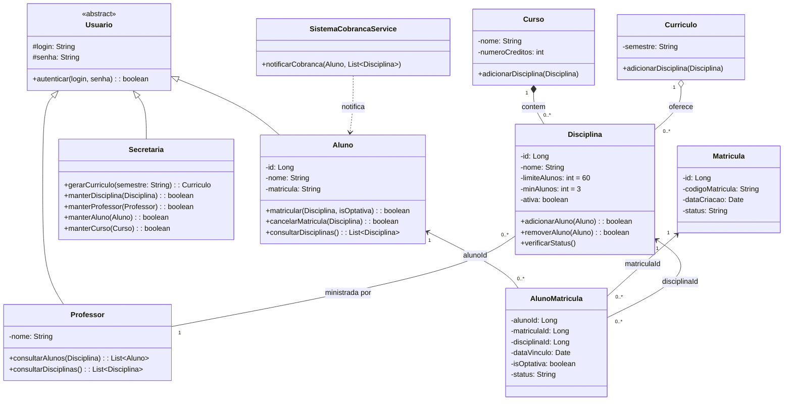

# Diagrama de Classes — v1.1 (correção do Lab01S02)

Correção do diagrama v1 feita pela equipe na Sprint 02: inclusão de identificadores (`id`) e das classes `Matricula` e `AlunoMatricula`, que substituem a associação direta entre `Aluno` e `Disciplina`. A versão atual está no [README](../../README.md).

