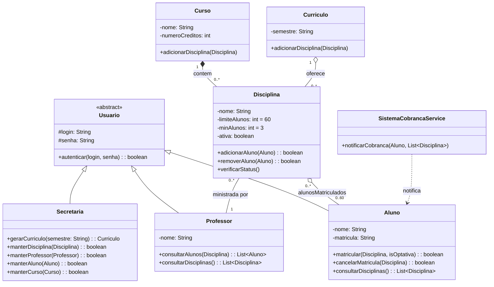

# Diagrama de Classes — v1 (Lab01S02)

Versão original do diagrama de classes, produzida na Sprint 02. A versão atual está no [README](../../README.md).

```mermaid
classDiagram
    class Usuario {
        <<abstract>>
        #login: String
        #senha: String
        +autenticar(login, senha): boolean
    }
    
    class Aluno {
        -nome: String
        -matricula: String
        +matricular(Disciplina, isOptativa): boolean
        +cancelarMatricula(Disciplina): boolean
        +consultarDisciplinas(): List~Disciplina~
    }
    
    class Professor {
        -nome: String
        +consultarAlunos(Disciplina): List~Aluno~
        +consultarDisciplinas(): List~Disciplina~
    }
    
    class Secretaria {
        +gerarCurriculo(semestre: String): Curriculo
        +manterDisciplina(Disciplina): boolean
        +manterProfessor(Professor): boolean
        +manterAluno(Aluno): boolean
        +manterCurso(Curso): boolean
    }
    
    Usuario <|-- Aluno
    Usuario <|-- Professor
    Usuario <|-- Secretaria
    
    class Curso {
        -nome: String
        -numeroCreditos: int
        +adicionarDisciplina(Disciplina)
    }
    
    class Disciplina {
        -nome: String
        -limiteAlunos: int = 60
        -minAlunos: int = 3
        -ativa: boolean
        +adicionarAluno(Aluno): boolean
        +removerAluno(Aluno): boolean
        +verificarStatus()
    }
    
    class Curriculo {
        -semestre: String
        +adicionarDisciplina(Disciplina)
    }
    
    class SistemaCobrancaService {
        +notificarCobranca(Aluno, List~Disciplina~)
    }
    
    Curso "1" *-- "0..*" Disciplina : contem
    Curriculo "1" o-- "0..*" Disciplina : oferece
    Disciplina "0..*" -- "1" Professor : ministrada por
    Disciplina "0..*" o-- "0..60" Aluno : alunosMatriculados
    SistemaCobrancaService ..> Aluno : notifica
```
